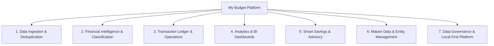

# 📑 Функціональна декомпозиція системи My Budget (Functional Decomposition)

| Метадані документа | Значення |
| :--- | :--- |
| **Проєкт** | My Budget — Local-First Financial Portal |
| **Домен** | Персональні фінанси, облік витрат, аналітика та економія |
| **Тип документа** | Functional Decomposition Document (FDD) |
| **Категорія** | Business Analysis Documents |
| **Версія** | 1.1.0 (SCRUM-22 Time Filter Overhaul) |
| **Дата оновлення** | 29 вересня 2026 р. |
| **Статус** | Затверджено (Актуальний стан релізу) |

---

## 1. Загальний огляд (Executive Overview)

**My Budget** — це автономний вебзастосунок для персонального фінансового менеджменту, побудований за концепцією **Local-First**. 
Всі фінансові дані, правила категоризації, ліміти та налаштування користувача обробляються й зберігаються безпосередньо у клієнтському сховищі браузера (**IndexedDB**), що гарантує абсолютну конфіденційність без передачі фінансових транзакцій на зовнішні бекенд-сервери.

Головна цінність продукту для користувача:
1. Автоматизація збору даних з банківських виписок (Monobank, Моно Бюджет, Toshl) без ручного введення.
2. Інтелектуальне очищення та категоризація транзакцій під реалії українського ринку.
3. Прозора візуалізація грошових потоків (Cashflow) та бюджетних лімітів.
4. Автоматичний пошук точок фінансової оптимізації («розумна економія», підписки, дрібні витрати).

---

## 2. Діаграма декомпозиції верхнього рівня

---

## 3. Детальна декомпозиція функціональних доменів (L1 → L2 → L3)

### Домен 1: Конвеєр імпорту та первинної обробки (Data Ingestion Pipeline)

* **1.1. Адаптери банківських виписок (Bank Statement Parsers)**
  * **1.1.1. Monobank Card Adapter:**
    * Підтримка форматів `.xlsx`, `.xls`, `.csv`.
    * Парсинг специфічного українського формату дати й часу (`DD.MM.YYYY HH:mm:ss`).
    * Обробка специфічних числових полів: базова сума, сума у валюті операції, комісії банку, нарахований кешбек.
    * Словникова інтерпретація кодів **MCC** (Merchant Category Code) для автоматичного визначення категорій.
  * **1.1.2. Mono Budget Adapter:**
    * Спеціалізований парсер вивантажень із розділу «Бюджет» додатку Monobank.
    * Обробка обов'язкових та опціональних колонок: `Date`, `Description`, `Category`, `Amount`, `Currency`, `Account`, `Tags`, `Note`, `Excluded from budget`.
    * Автоматична детекція та створення бізнес-рахунків (ФОП) і накопичувальних банок.
  * **1.1.3. Toshl Finance Adapter:**
    * Парсинг мультивалютних експортів Toshl Finance з розмежуванням тегів, категорій та типів рахунків.
    * Сувора валідація та нормалізація форматів дат `DD.MM.YY` (з приведенням до `20YY`) та `DD.MM.YYYY` до стандарту ISO `YYYY-MM-DD` без часових артефактів (повна відмова від штучного часу `T12:00:00`).
    * Валідація високосних років (29 лютого) та календарних меж кожного місяця.
    * Інтерфейс інтерактивного відновлення даних (Date Picker) у вікні імпорту для ручного вказання дат у рядках з відсутніми або пошкодженими датами.
  * **1.1.4. Universal / Generic Auto-detector:**
    * Евристичний аналізатор заголовків файлу: автоматично визначає постачальника виписки без необхідності користувачу вручну обирати тип файлу.

* **1.2. Механізм дедуплікації (Deduplication Engine)**
  * **1.2.1. Криптографічний фінгерпринт:** Генерація детермінованого SHA-256 хешу на базі нормалізованих полів `SHA256(date + amount + description + accountId)`.
  * **1.2.2. Запобігання дублікатам:** При повторному завантаженні однакових або перекриваючихся виписок існуючі транзакції автоматично ігноруються, зберігаються лише нові.

* **1.3. Попередній перегляд перед записом (Pre-import Audit)**
  * **1.3.1. Зведений звіт імпорту:** Відображення загальної кількості рядків у файлі, кількості виявлених дублікатів та кількості нових рядків.
  * **1.3.2. Автовиявлення платіжних карток:** Детекція нових рахунків/карток у документі з пропозицією створити їх у базі даних в один клік.

---

### Домен 2: Інтелектуальна нормалізація даних (Financial Intelligence & Enrichment)

* **2.1. Словник контрагентів (Merchant Dictionary)**
  * **2.1.1. Очищення та нормалізація брендів:** Очищення технічних банківських назв терміналів до охайних назв (наприклад: `TOV SILPO-FOOD` → `Сільпо`, `UKLON KYIV` → `Uklon`, `WOG AZS` → `WOG`, `NOVA POSHTA` → `Нова Пошта`).
  * **2.1.2. База локальних українських брендів:** Вбудований довідник роздрібних мереж (АТБ, Сільпо, Varus, Фора), АЗС (ОККО, WOG, SOCAR, KLO), служб таксі/доставки (Bolt, Uklon, Glovo) та аптек.

* **2.2. Класифікатор типів фінансових операцій (Transaction Type Classifier)**
  * **2.2.1. Типізація операцій:** Розподіл на 5 бізнес-типів:
    * `expense` — споживчі витрати на життя.
    * `income` — доходи (зарплата, виплати ФОП, кешбек, відсотки).
    * `savings_jar` — заощадження у банках, скарбничках або депозитах.
    * `transfer` — перекази між власними картками/зняття готівки в банкоматах.
    * `refund` — повернення коштів (скасування поїздок у таксі, повернення товарів).
  * **2.2.2. Зв'язування повернень (Refund Matcher):** Автоматичний пошук пари «первинна витрата ↔ компенсація/повернення» та лінкування операцій.

* **2.3. Двигун користувацьких правил категоризації (Rule Engine)**
  * **2.3.1. Конструктор гнучких правил:** Налаштування автоматичного мапінгу за полями `description`, `mcc`, `originalCategory` з підтримкою операторів `contains`, `equals`, `startsWith`, `regex`.
  * **2.3.2. Ретроспективний перерахунок (Backfill):** Застосування новоствореного правила до всієї історії вже збережених транзакцій.

---

### Домен 3: Операційний облік та журнал транзакцій (Ledger & Operations)

* **3.1. Багатофакторна фільтрація та пошук**
  * **3.1.1. Система фільтрів:** Фільтрація за типом операції, категорією, джерелом виписки, конкретною банківською картою/рахунком та статусом включення в бюджет.
  * **3.1.2. Повнотекстовий пошук:** Миттєвий пошук за очищеною назвою торговця, оригінальним описом або нотатками користувача.
  * **3.1.3. Часові зрізи та фільтр періодів (SCRUM-22):**
    * **Останній звітний місяць:** Автоматичне динамічне визначення найсвіжішого місяця у базі (`date <= now`) з текстовою назвою українською (наприклад, *«Звітний місяць: Серпень 2024»*) та розрахунком MoM-порівняння з попереднім календарним місяцем.
    * **Поточний рік:** Швидка фільтрація за поточним календарним роком системи (`01.01.YYYY — 31.12.YYYY`) із зіставленням з попереднім календарним роком.
    * **Календарний діапазон (DateRangePicker):** Інтерактивний вибір довільного періоду через спеціалізований React-компонент календаря зі швидкою навігацією між роками (`<<`, `>>`) та місяцями (`<`, `>`), вибором діапазону в два кліки та динамічним підрахунком кількості днів.
    * **Область видимості (Scoping):** Фільтр часу діє на вкладки **Дашборд** та **Журнал транзакцій**, тоді як вкладки **Глибока аналітика** та **Розумна економія** оперують повним набором транзакцій для цілісного аналізу всієї фінансової історії.

* **3.2. Масові та поодинокі дії з операціями (Bulk & Inline Actions)**
  * **3.2.1. Inline-редагування:** Зміна категорії, підкатегорії та текстових нотаток безпосередньо у списку.
  * **3.2.2. Призначення карток:** Прив'язка окремої транзакції або вибраної групи транзакцій до конкретного платіжного рахунку.
  * **3.2.3. Виключення з бюджету (Budget Exclusion):** Маркування переказів, робочих витрат ФОП або внутрішніх транзакцій як таких, що не впливають на розрахунок особистих лімітів витрат.
  * **3.2.4. Пакетне видалення:** Безпечне групове видалення помилково завантажених рядків.

---

### Домен 4: Аналітика та візуалізація показників (BI & Visualizations)

* **4.1. Керівні фінансові KPI (Executive Dashboard)**
  * **4.1.1. Базові метрики:** Загальні витрати, Загальні доходи, Чистий кешфлоу (Net Cashflow), Рівень заощаджень (% Savings Rate).
  * **4.1.2. MoM-порівняння (Month-over-Month):** Динамічне зіставлення показників із попереднім аналогічним періодом з кольоровою індикацією зростання або спаду.

* **4.2. Інтерактивні діаграми (Ant Design Plots / AntV G2)**
  * **4.2.1. Category Donut Chart:** Кільцева діаграма розподілу витрат за категоріями з процентною часткою та клікабельним переходом до транзакцій.
  * **4.2.2. Cashflow Column Chart:** Згрупована помісячна стовпчикова діаграма співвідношення доходів та витрат.
  * **4.2.3. Top Merchants Bar Chart:** Горизонтальний рейтинг торгових точок із найбільшими обсягами витрат.
  * **4.2.4. Budget Progress List:** Шкали виконання встановлених лімітів за категоріями з колірною сигналізацією перевитрат (зелений / бурштиновий / червоний).
  * **4.2.5. 365-Day Activity Heatmap:** Календарна теплова карта щоденної фінансової активності за останні 365 днів (у стилі GitHub Activity).

* **4.3. Спеціалізовані локальні віджети**
  * **4.3.1. Монітор допомоги ЗСУ та благодійності (Charity & ZSU Widget):** Автоматичний підрахунок донатів у волонтерські фонди, відсоток від загального доходу та перелік підтриманих ініціатив.
  * **4.3.2. Чеклист оплати комунальних послуг (Utilities Checklist):** Щомісячний моніторинг обов'язкових платежів (Газ, Електроенергія, Вода, Опалення, Інтернет/ОСББ).

---

### Домен 5: Модуль фінансового консалтингу (Smart Savings & Advisory Engine)

* **5.1. Детектор регулярних підписок (Subscriptions Engine)**
  * Виявлення періодичних щомісячних платежів (Apple, Google, Netflix, Spotify, YouTube, Megogo, Kyivstar тощо) та розрахунок їхнього щорічного навантаження на особистий бюджет.

* **5.2. Аналізатор «Ефекту лате» (Micro-expenses Analyzer)**
  * Автоматична агрегація та аналіз частих мікровитрат (суми < 180 ₴: кава, снеки, імпульсивні чеки) з оцінкою потенціалу заощаджень за рік.

* **5.3. Детектор аномальних сплесків (Expense Spikes Detection)**
  * Виявлення дисбалансу витрат на доставку та ресторани відносно базової закупівлі продуктів харчування.

* **5.4. Аудит за пропорцією 50/30/20**
  * Перевірка розподілу коштів на «Базові потреби» (Needs — 50%), «Бажання та розваги» (Wants — 30%) та «Заощадження/Резерви» (Savings — 20%).

---

### Домен 6: Керування довідниками та сутностями (Master Data Management)

* **6.1. Довідник категорій та підкатегорій:**
  * Створення та редагування категорій, вибір фірмових кольорів, іконок Lucide та визначення статусу життєвої необхідності (`isEssential`).
* **6.2. Встановлення лімітів бюджету:**
  * Налаштування щомісячних лімітів у валюті за категоріями з конфігурацією порогу попередження (Alert Threshold, стандартно 80%).
* **6.3. Менеджер банківських карток та рахунків:**
  * Ведення карток з фіксацією останніх 4 цифр (`last4`), маски (`**** 1234`), кольорових акцентів та призначення ролей (особиста, спільна сімейна, бізнес ФОП).

---

### Домен 7: Безпека, конфіденційність та платформа (Platform & NFRs)

* **7.1. Архітектура Local-First:**
  * Збереження всіх операцій та конфігурацій виключно на стороні клієнта в **IndexedDB** (`Dexie.js`).
  * Повна автономність: застосунок працює без бекенд-сервера, відсутні ризики витоку персональних даних.
* **7.2. Резервне копіювання та міграції (Disaster Recovery):**
  * Експорт повної бази даних в один файл JSON (`my-budget-backup-YYYY-MM-DD.json`).
  * Відновлення бази з бекап-файлу в один клік.
  * Можливість повного очищення локальної бази даних.
* **7.3. Мультивалютний модуль:**
  * Базова валюта — гривня (UAH) з підтримкою динамічного перерахунку інтерфейсу в USD та EUR за актуальними або фіксованими курсами.
* **7.4. Ергономіка інтерфейсу:**
  * Підтримка темної та світлої системних тем із сучасним дизайном (CSS Tokens, адаптивна верстка під мобільні та десктопні пристрої).

---

## 4. Матриця трасування (Traceability Matrix: Функція ↔ Компонент/Файл)

| Функціональний блок | Основні файли реалізації |
| :--- | :--- |
| **Парсинг та дедуплікація** | `src/services/parsers/ingestionManager.ts` `src/services/parsers/monobankAdapter.ts` `src/services/parsers/monoBudgetAdapter.ts` `src/services/parsers/toshlAdapter.ts` `src/services/parsers/deduplication.ts` |
| **Інтелект контрагентів та правил** | `src/services/intelligence/merchantDictionary.ts` `src/services/intelligence/recognitionEngine.ts` `src/services/intelligence/savingsDetector.ts` `src/services/intelligence/refundMatcher.ts` `src/services/rules/ruleEngine.ts` |
| **Журнал транзакцій та масові дії** | `src/components/transactions/TransactionsExplorer.tsx` `src/components/cards/CardBadge.tsx` `src/components/cards/CardNumberInput.tsx` |
| **BI та аналітичні графіки** | `src/services/analytics/kpiCalculator.ts` `src/components/dashboard/KPICards.tsx` `src/components/dashboard/CashflowChart.tsx` `src/components/dashboard/CategoryDonutChart.tsx` `src/components/dashboard/TopMerchantsChart.tsx` `src/components/dashboard/CharityZSUWidget.tsx` `src/components/dashboard/UtilitiesChecklistWidget.tsx` `src/components/analytics/HeatmapCalendar.tsx` |
| **Розумна економія (Smart Savings)** | `src/services/analytics/smartSavings.ts` `src/components/insights/SmartSavingsView.tsx` |
| **Керування картками, категоріями, бекапами** | `src/components/settings/CardsManager.tsx` `src/components/settings/CategoryManager.tsx` `src/components/settings/BudgetLimitsManager.tsx` `src/components/settings/DataManagementModal.tsx` |
| **База даних та типи** | `src/db/database.ts` `src/types/finance.ts` |
