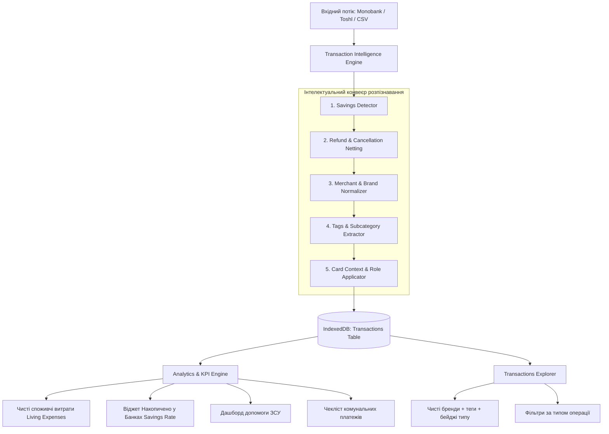

# Дизайн-специфікація: Інтелектуальний конвеєр розпізнавання транзакцій (Transaction Intelligence Engine)

**Дата**: 2026-09-09  
**Статус**: Погоджено  
**Автор**: Antigravity & User  

---

## 1. Мета та контекст

При імпорті виписок із Monobank та Toshl Finance понад 45% операцій отримують неінформативну категорію `Other` або містять зашумлений технічний опис еквайрингу (`LIQPAY*Ehrle`, `LIQPAY*TOV HUDTIKET`, `WFP.TICKETAG`). 

Крім того, специфіка українського банкінгу (зокрема функції Monobank «Округлення залишку в Банку» та «% від витрат на примхи») генерує десятки мікротранзакцій накопичень, які в стандартних додатках помилково роздувають цифру повсякденних споживчих витрат на десятки тисяч гривень.

### Ключові цілі:
1. **Ізоляція накопичень у «Банках»**: автоматичне відокремлення внутрішніх заощаджень (округлення, відсоток витрат, поповнення/зняття банок, депозити) від реальних споживчих витрат.
2. **Очищення та нормалізація брендів**: перетворення технічних назв шлюзів на впізнавані українські бренди з категоризацією та тегами другого рівня.
3. **Неттінг повернень та скасувань**: автоматичне виявлення скасованих поїздок (Bolt) та повернень і зменшення витрат відповідної категорії замість створення фіктивного доходу.
4. **Виділення спеціальних категорій**:
   - Військові донати та збори (АХІЛЛЕС, 3 ОШБ, UAnimals);
   - Комунальні платежі з щомісячним моніторингом (Світло, Газ, ОСББ, Київстар);
   - Доходи від підприємницької діяльності (ФОП), повернення депозитів та кешбек.
5. **Профілювання карток**: врахування ролі картки (Біла/Спільна — побут і сім'я; Чорна — особисті витрати/примхи; Зроблено в Україні — нацкешбек).

---

## 2. Архітектура рішення



---

## 3. Специфікація моделі даних

### 3.1. Розширення типів (`src/types/finance.ts`)

```typescript
export type TransactionType = 
  | 'expense'       // Споживча витрата
  | 'income'        // Дохід (ФОП, заробітна плата, кешбек)
  | 'savings_jar'   // Накопичення у «Банку» (округлення, % витрат, депозит)
  | 'transfer'      // Внутрішній переказ (між власними рахунками, банкомат)
  | 'refund';       // Повернення/скасування

export interface Transaction {
  id: string;
  hash: string;
  date: string;
  amount: number;
  currency: CurrencyCode;
  originalAmount?: number;
  originalCurrency?: string;
  description: string;          // Початковий опис із виписки
  cleanMerchant?: string;       // Нормалізований бренд (напр. "Ehrle (Автомийка)")
  originalCategory?: string;
  categoryId: string;
  subCategory?: string;
  tags?: string[];              // Теги: ["groceries"], ["fuel"], ["zsu"]
  mcc?: number;
  source: 'monobank' | 'toshl' | 'generic' | 'manual';
  accountId: string;
  cardLast4?: string;
  cardNumberMasked?: string;
  notes?: string;
  isSubscription?: boolean;
  
  // Нові аналітичні атрибути
  transactionType: TransactionType;
  isSavings?: boolean;          // true для операцій накопичення
  linkedTransactionId?: string; // ID парної операції повернення чи банкомату
}

export interface Account {
  id: string;
  name: string;
  type: 'bank_card' | 'cash' | 'savings' | 'other';
  currency: CurrencyCode;
  cardLast4?: string;
  cardNumberMasked?: string;
  color?: string;
  role?: 'shared_family' | 'personal' | 'cashback_national' | 'general';
}
```

---

## 4. Специфікація модулів ядра розпізнавання (`src/services/intelligence/`)

### 4.1. `savingsDetector.ts`
Аналізує опис операції на патерни сервісів накопичень Monobank:
- **Критерії**:
  - `Округлення балансу` (наприклад, «Накопичення спільні», «На примхи»)
  - `На примхи` (регулярне списання відсотка від суми покупки)
  - `Поповнення «...»` / `Часткове зняття банки «...»`
  - `Відкриття депозиту`
- **Дія**:
  - Встановлює `transactionType = 'savings_jar'`.
  - Встановлює `isSavings = true`.
  - Додає тег `['savings', 'jar']`.

### 4.2. `refundMatcher.ts`
Аналізує позитивні операції, які є компенсацією або скасуванням:
- **Критерії**:
  - Назва містить `Скасування.` (наприклад, `Скасування. Bolt`)
  - Назва містить `Повернення` / `Refund`
  - Сума збігається зі списанням за останні 48 годин
- **Дія**:
  - Встановлює `transactionType = 'refund'`.
  - Встановлює категорію оригінальної операції (наприклад, `transport` для Bolt).
  - У звітах витрат ця сума вираховується з загальних витрат відповідної категорії.

### 4.3. `merchantDictionary.ts`
Каталог українських торговельних мереж, онлайн-сервісів та еквайрингу:

| Вхідний патерн | Очищений бренд | Категорія | Теги |
|---|---|---|---|
| `LIQPAY*Ehrle` | Ehrle (Автомийка) | `transport` | `['wash', 'car']` |
| `LIQPAY*TOV HUDTIKET`, `WFP.TICKETAG` | Квитки на події | `leisure` | `['tickets', 'events']` |
| `LIQPAY*World Book`, `Yakaboo` | Книгарня | `leisure` | `['books']` |
| `Рукавичка`, `Близенько`, `Сімі`, `АТБ`, `Сільпо`, `Галицька Свіжина`, `Вацак`, `Галя Балувана`, `Україночка`, `ROSHEN`, `Egastronom` | [Назва мережі] | `groceries` | `['supermarket']` |
| `McDonald’s`, `Lviv Croissants`, `Daily Dose`, `CHEESE BAKERY`, `SHOco.`, `Cult Comedy Hall`, `Інтемпо`, `Spiro pasta bar`, `BUREK`, `LA LA PITSA`, `Domino’s Pizza`, `Гуцульська Ґражда`, `Sushi King` | [Назва закладу] | `dining` | `['restaurants']` |
| `ОККО`, `WOG`, `БРСМ-Нафта`, `UKRNAFTA`, `Amic` | [Назва АЗС] | `transport` | `['fuel']` |
| `Автосалон Рено` | Автосалон Рено | `transport` | `['car', 'servicing']` |
| `Аптека 3i`, `Аптека «Подорожник»` | [Назва аптеки] | `health` | `['medicine']` |
| `LDENT` | Стоматологія LDENT | `health` | `['dentist']` |
| `lipss`, `Blisk` | Косметика та догляд | `health` | `['cosmetics']` |
| `Animalboutique`, `MasterZoo` | Товари для тварин | `other` | `['pets']` |
| `Steam` | Steam (Ігри) | `leisure` | `['games']` |
| `Netflix`, `Patreon`, `Google` | [Сервіс] | `subscriptions` | `['streaming', 'software']` |
| `Регулярне поповнення «АХІЛЛЕС»`, `3 ОШБ`, `UAnimals`, `LIQPAY*Blahodiyna Orha` | [Фонд / Підрозділ] | `charity` | `['zsu', 'volunteer']` |
| `Електроенергія`, `Газ (доставлення)`, `ОСББ`, `Київстар` | Комунальні послуги | `housing` | `['utilities']` |

### 4.4. Доходи, перекази та готівка
- `З гривневого рахунку ФОП`: `transactionType = 'income'`, категорія `income_salary` (Основний дохід ФОП).
- `Виведення кешбеку`, `Виплата кешбеку від держави`: `transactionType = 'income'`, категорія `income_other`, тег `['cashback']`.
- `Банкомат DN00`, `З Чорної картки`: `transactionType = 'transfer'`, тег `['transfer']`.

---

## 5. Зміни в користувацькому інтерфейсі (UI/UX)

1. **Головний Дашборд**:
   - `KPICards.tsx`: Метрика «Чисті витрати» виключає операції з `isSavings: true` та враховує `refund`.
   - Новий KPI-блок: **«Заощаджено у Банках»** + **Savings Rate %**.
   - Новий віджет: **«Допомога ЗСУ та Благодійність»** (загальна сума донатів за місяць).
   - Новий блок: **«Чекліст комунальних платежів»** (перевірка оплати світла, газу, ОСББ та зв'язку).
2. **Таблиця транзакцій (`TransactionsExplorer.tsx`)**:
   - Колонка з очищеною назвою бренду `cleanMerchant` та дрібним текстом оригінального рядка.
   - Кольорові бейджі типу операції: `🏺 Банка`, `↩️ Скасовано`, `🔄 Переказ`, `🇺🇦 ЗСУ`.
   - Відображення тегів другого рівня.
   - Фільтр: *«Усі типи»*, *«Тільки витрати на життя»*, *«Накопичення (Банки)»*, *«Повернення»*, *«Донати»*.
3. **Налаштування**:
   - Кнопка **«Перерозпізнати транзакції»** для миттєвого оновлення всіх існуючих записів у базі новим ядром.

---

## 6. План валідації та тестування

- **Unit-тести (`test/intelligence.test.ts`)**:
  - Тестування `savingsDetector`: правильне виявлення «Округлення балансу» та «На примхи».
  - Тестування `refundMatcher`: виявлення скасувань Bolt та коректний розрахунок неттінгу.
  - Тестування `merchantDictionary`: правильне очищення LiqPay, розпізнавання брендів та тегів.
  - Тестування коректного виключення банок з калькулятора KPI (`kpiCalculator.test.ts`).
